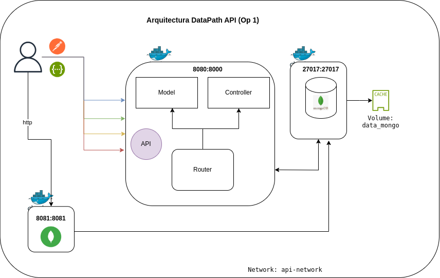

# DataPath API
Repositorio de proyecto para la conexión de APIs con python hacia bases de datos y hacia modelos predictivos.

Las opciones a implementar son 2

1. Desarrollo de API conectado a una BD
2. Desarrollo de API para predicciones ML

Los métodos a usar son: 
* GET
* POST
* PUT
* DELETE

### 1. Desarrollo de API conectado a una BD
Se selecciona como base de datos `Mongo DB` y como framework para el api `FastAPI`

---
##### Arquitectura de la solución


---
#### Estructura del proyecto:
```nginx
| - app
    | - connectors
        | - mongoConnect.py
    |- controllers
    	| - moviesController.py
    | - models
	    | - moviesModel.py
    | - routers
    	| - moviesRoute.py	    
    | - main.py
| - mongoDB
	| - mongo-init
	    | - mongo-init.js
	| - Dockerfile
| - uvicorn
	| - Dockerfile
| - .dockerignore
| - .env
| - .gitignore
| - Arquitectura.png
| - build.sh
| - docker-compose.yml
| - down.sh
| - LICENSE
| - README.md
| - requirements.txt
| - stop.sh
| - up.sh
```
#### Contenidos de las carpetas
`app` contiene todos los archivos necesarios de nuestra aplicación.

`app.connectors` contiene las conexiones a bases de datos usadas por la aplicación.

`app.controllers` contiene los controladores de la aplicación.

`app.models` contiene los modelos usados por la aplicación.

`app.routers` contiene los routes que conectan con cada request de nuestra aplicación.

***Nota***: se usa el nombre `routers` ya que genera conflicto con un modulo de *FastAPI* si se usa `routes`.

`mongoDB` contiene los archivos necesarios para la creación de la imagen y precarga de la bases de datos usada por la aplicación.

`mongoDB.mongo-init` contiene el archivo con los registros de precarga javascript para la base de datos.

`uvicorn` contiene el archivo para la creación de la imagen para el servidor en el que se despliega la aplicación. 

Los demás archivos, algunos son estandares y los otros se irán explicando según su importancia de uso. 

---
#### Estructura de la Base de datos

> **Base de datos**: my_collections *o el nombre que se haya dado en la variable de ambiente `MONGO_DATABASE`*.
>
> **Colección**: `my_movies` nombre de la colección 
>
> **Estructura del documento**:
>
> `id`: id de la pelicula *(autoincremental)*
> 
>`autor`: autor de la película
> 
>`descripcion`: nombre de la palicula
> 
>`fecha_estreno`: Fecha en que se estrenó la película

**Precarga de data**
En el archivo `mongo-init.js` se hace carga inicial de datos para la base de datos `my_collections`

---
#### Preparacióon
**.env**: El archivo `.env` que será usado por el `docker-compose.yml` se debe crear en la ruta del proyecto, con los siguientes parámetros:
```
MONGODB_ADMIN_USERNAME: <usuarioroot para mongo>
MONGODB_ADMIN_PASSWORD:<password para usuario root moongo>
MONGO_DATABASE:my_collections

# mongo express
BASICAUTH_USERNAME:<usuario para conexión a mongo express>
BASICAUTH_PASSWORD:<password del usuario mongo express>
```

---
#### Creación de imagenes
Para la creación de las imagenes, estando en la ruta del archivo `build.sh` se ejecuta con bash solo la primera vez.

build.sh
> docker build -f mongoDB/Dockerfile -t mongo:`<tag>` . 
> 
> docker build -f uvicorn/Dockerfile -t uvicorn:`<tag>` .

Donde `<tag>` por defecto viene con `pedro` pero puede ser cambiada a gusto de la persona por otro valor, si esta se cambia, también se debe ajsutar en el archivo `docker-compose.yml` y cambiar por el tag asignado en cada uno de los servicios en la propiedad `image`

```commandline
. build.sh
```
Con esto se crearan las imagenes que se usaran en los servicios del `docker-compose.yml`

**mongo:pedro:** Imagen de la base de datos de `mongodb`

**uvicorn:pedro:** Imagen del servidor `uvicorn`

**Nota:**
*La imagen **mongo-express** es creada a partir de la imagen estándar desde el `docker-compose.yml`* 

---
##### Ejecución de las contenedores
Para la creación y ejecución de los contenedores se debe estár ubicado en la ruta del archivo `docker-compose.yml` y ejecutar el comando docker `docker compose up -d` o estando en la ruta del archivo `up.sh`, se puede ejecutar ya que cumple la misma función.

up.sh
> docker compose up -d

Este creará los contenedores usados por los servicios 
```commandline
. up.sh
```

---
#### Acceso a contenedores
Las urls generadas de los servicios, por los contenedores son las siguientes:

**uvicorn_server** http://localhost:8080 : se puede adicionar /docs para ver y consumir las apis por medio de `swagger` o iniciar por medio de una herramienta tipo `postman` se pueden empezar a consumir:
>```
>/              métodos: GET
> 
> /movies/      métodos: GET / POST
> 
> /movies/{id}  métodos: GET / PUT / DELETE
>```
**mongo_frontend** http://localhost:8081 : para ingresar se deben digitar los valores que se dejaron en la variables de ambiente `BASICAUTH_USERNAME`, `BASICAUTH_PASSWORD` en el archivo `.env`

---
#### Ejemplo estructura para consultar
Usando herramientas como swagger o postman se pueden enviar a los distintos metodos creados 

***/ GET*** Da un saludo de bienvenida al usuario

***/movies/ GET*** No requiere parámetros, al consultar retornara una lista de los registros en la base de datos hasta un tope de 1000

***/movies/ POST*** *(body)* se envia usando el cuerpo con la estructura como se ve a continuación *recibe solamente un registro por vez.*
```commandline
{
  "autor": "Jane Doe",
  "descripcion": "the revenge of 5 against 1",
  "fecha_estreno": "01-12-1900"
}
``` 

***/movies/{id} GET / PUT / DELETE*** Se reemplaza el campo `{id}` por el valor del id a consultar, modificar o eliminar.

---
#### Detención de los contenedores
Para la detención de la ejecución de los contenedores se debe estár ubicado en la ruta del archivo `docker-compose.yml` y ejecutar el comando docker `docker compose down` o estando en la ruta del archivo `down.sh`, se puede ejecutar ya que cumple la misma función.

down.sh
> docker compose down -v

Esto eliminará los contenedores usados por los servicios y los volumenes asociados.
```commandline
. down.sh
```

Otra alternativa es ejecutar el comando `docker compose stop` o el archivo `stop.sh` con lo cual solamente se detendrán los contenedores, manteniendo el último estado de los mismos.

```commandline
. stop.sh
```

### ¡Buen viaje!